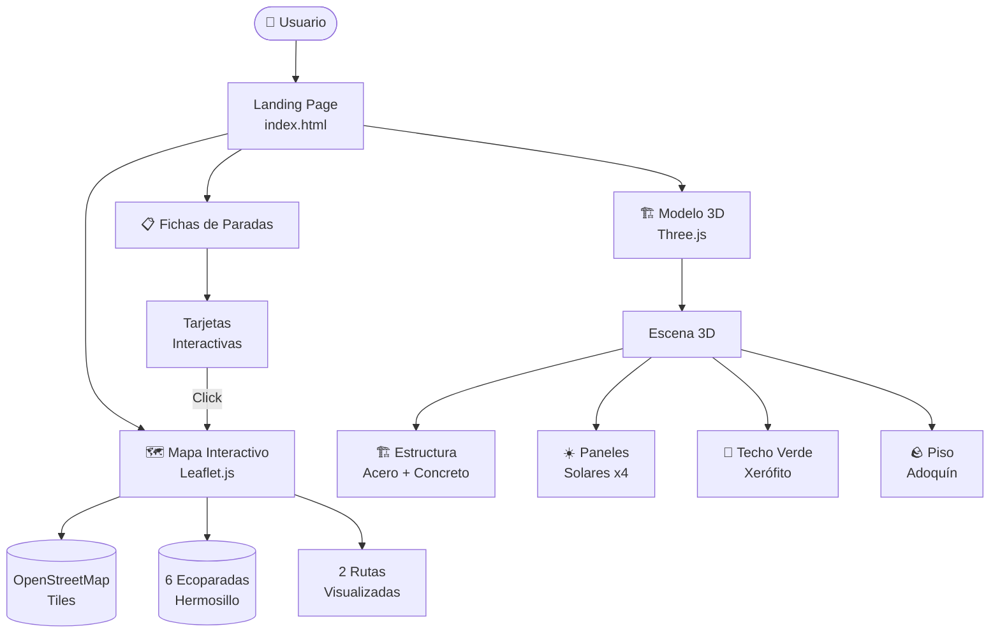
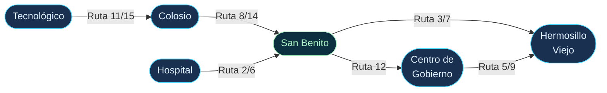
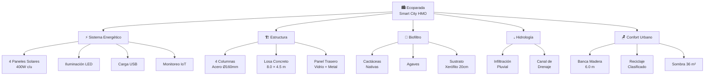
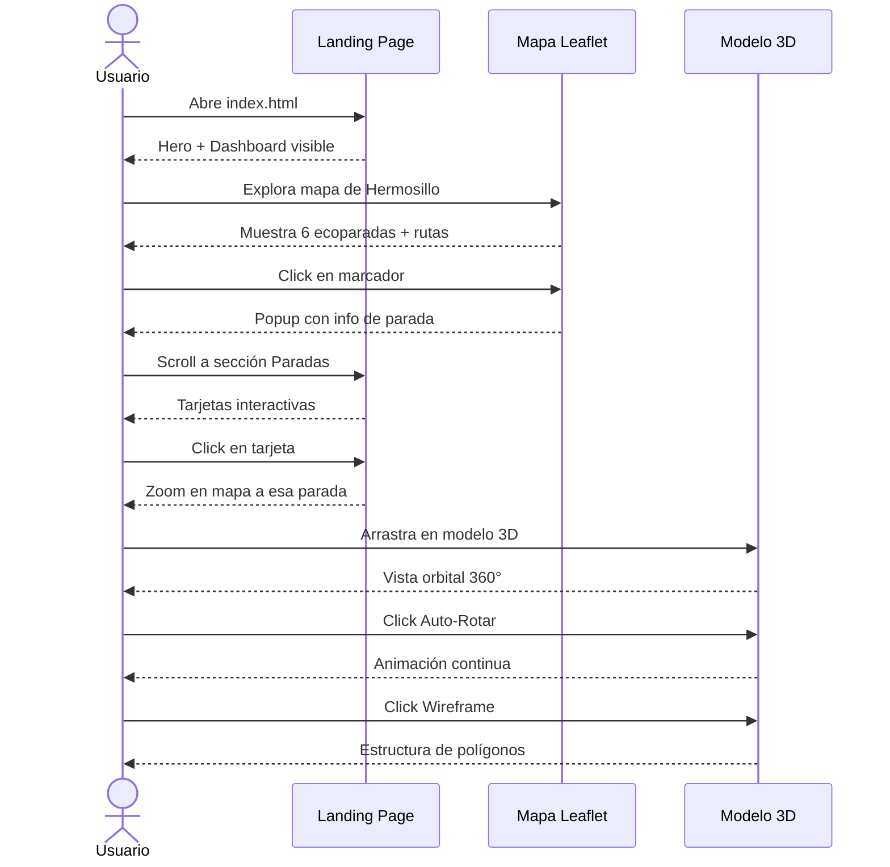

# 🌍 Smart City HMO - Paradas Ecológicas de Hermosillo

Proyecto interactivo que presenta **paradas de autobús ecológicas inteligentes** para Hermosillo, Sonora. Incluye una landing page con mapa interactivo y un modelo 3D completo de una parada de autobús con características sostenibles.

---

## �️ Arquitectura del Sistema



## �📁 Archivos del Proyecto

### 1. **index.html** - Landing Page Principal
- Información general del proyecto
- Mapa interactivo de Hermosillo con paradas ecológicas
- Rutas de transporte disponibles
- Especificaciones técnicas
- Enlaces al modelo 3D
- Diseño responsivo y moderno

**Características:**
- 🗺️ Mapa Leaflet con marcadores de paradas
- 📍 6 paradas ecológicas distribuidas en Hermosillo
- 🚌 7 rutas de transporte
- 📱 Interfaz responsive para móvil/tablet/escritorio
- 🎨 Diseño futurista con gradientes y efectos visuales

### 2. **model.html** - Modelo 3D Interactivo
Modelo 3D completo de la **Parada San Benito – Ruta 12** creado con **Three.js**.

**Componentes visuales:**
- ☀️ **4 Paneles Solares** (400W cada uno = 1.6 kW)
- 🌵 **Techo Verde** con cactáceas y agaves xerófitas
- 🏗️ **Estructura Paramétrica** de acero galvanizado
- 🪑 **Banca de Madera** con soportes metálicos
- 🗑️ **Bote de Reciclaje** inteligente
- 💧 **Sistema de Infiltración de Agua** lluvia
- 🏜️ **Entorno Desértico** de Hermosillo

**Controles interactivos:**
- 🖱️ **Arrastrar izquierda**: Rotar cámara
- 🖱️ **Arrastrar derecha**: Mover (paneo)
- 🖱️ **Scroll**: Zoom
- 📐 Vistas predefinidas: Frente / Lateral / Planta / ISO
- ⟳ Auto-rotación continua
- ◻️ Modo Wireframe para ver estructura

---

## � Red de Rutas



## �🗺️ Paradas en el Mapa

| Nombre | Ruta | Ubicación | Características |
|--------|------|-----------|-----------------|
| **San Benito** | 12 | Centro | Paneles Solares, Techo Verde, Recarga USB |
| **Colosio** | 8, 14 | Comercial | Paneles Solares, Reciclaje, Sombra Natural |
| **Centro de Gobierno** | 5, 9 | Administrativa | Techo Verde, Accesibilidad, Iluminación LED |
| **Tecnológico** | 11, 15 | Educativa | IoT, WiFi Público, Recarga USB |
| **Hermosillo Viejo** | 3, 7 | Cultural | Plantas Nativas, Área de Descanso |
| **Hospital** | 2, 6 | Sanitaria | Accesibilidad, Emergencia, Asientos Especiales |

---

## 🏗️ Componentes de la Parada



---

## 📊 Especificaciones Técnicas

### Dimensiones
- **Ancho**: 8.0 m
- **Largo**: 4.5 m
- **Altura**: 4.2 m
- **Área de Cobertura**: 36 m²

### Energía
- **Capacidad Solar**: 4 paneles × 400W = **1.6 kW**
- **Producción diaria**: ~6.4 kWh (en Hermosillo)
- **Usos**: Iluminación LED, Recarga de dispositivos, Monitoreo IoT

### Vegetación (Techo Verde)
- **Área**: 32 m²
- **Profundidad de sustrato**: 20 cm
- **Plantas**: 8 especies xerófitas (agaves, cactáceas)
- **Reducción térmica**: 5-8°C en días calurosos

### Estructura
- **Material**: Acero galvanizado con epóxico
- **Capacidad de Asientos**: 12-15 personas
- **Vida Útil**: 25+ años
- **Mantenimiento**: Anual

### Sostenibilidad
- ♻️ Contenedores de reciclaje clasificados
- 💧 Sistema de infiltración de agua lluvia
- 🌱 Plantas nativas adaptadas al clima desértico
- ⚡ 100% energía renovable

---

## 🚀 Cómo Usar

### Acceder a la Landing Page
1. Abre `index.html` en tu navegador
2. Explora el mapa interactivo
3. Haz clic en "Ver Modelo 3D" para acceder al modelo tridimensional

### Interactuar con el Modelo 3D
1. En `model.html`, usa los controles de ratón:
   - **Click izquierdo + arrastrar**: Rotar vista
   - **Click derecho + arrastrar**: Mover cámara
   - **Scroll**: Zoom in/out
2. Usa los botones en la parte inferior:
   - ↺ RESET: Vuelve a la posición inicial
   - ⟳ AUTO-ROTAR: Rotación automática continua
   - ◻ WIREFRAME: Ver estructura de polígonos
   - Botones de vista: Cambia la perspectiva

---

## � Flujo de Usuario



---

## �🛠️ Tecnologías Utilizadas

### Landing Page
- **HTML5** - Estructura
- **CSS3** - Diseño responsivo con gradientes y animaciones
- **JavaScript** - Interactividad
- **Leaflet.js** - Mapas interactivos
- **OpenStreetMap** - Datos de mapas

### Modelo 3D
- **Three.js** - Motor gráfico 3D
- **WebGL** - Renderizado en navegador
- **JavaScript** - Interactividad y animaciones

---

## 📦 Archivos Incluidos

```
smartcityhmo/
├── index.html          # Landing page principal
├── model.html          # Modelo 3D interactivo
├── README.md           # Este archivo
└── .git/               # Repositorio git
```

---

## 🎨 Diseño y Colores

### Paleta de Colores
- **Primario**: `#4dd8ff` (Cyan brillante)
- **Secundario**: `#a8f0c0` (Verde claro)
- **Acento**: `#ffd04d` (Amarillo dorado)
- **Fondo Oscuro**: `#0a0f1a` (Azul profundo)
- **Texto Principal**: `#e0f0ff` (Azul claro)

### Tipografía
- **Headings**: Exo 2 (700-900 weight)
- **Monospace**: Space Mono (para datos técnicos)

---

## 📱 Responsividad

El proyecto es **100% responsive** y funciona perfectamente en:
- ✅ Escritorio (1920px+)
- ✅ Tablet (768px-1024px)
- ✅ Móvil (320px-767px)

---

## 🌟 Características Destacadas

### 🔴 Landing Page
- Diseño minimalista y moderno
- Animaciones fluidas
- Mapa interactivo con Leaflet
- Información completa del proyecto
- CTAs claros y accesibles
- Modo nocturno futurista

### 🟢 Modelo 3D
- Modelo detallado y realista
- Múltiples perspectivas de cámara
- Iluminación avanzada (ambient, directional, point lights)
- Sombras dinámicas
- Texturizado completo
- Interacción en tiempo real
- Wireframe mode para análisis estructural

---

## 📊 Por abrir en

- **Landing Page**: `index.html` en navegador
- **Modelo 3D**: `model.html` en navegador
- Requiere conexión a internet para cargar recursos externos (Leaflet, Three.js, fonts)

---

## 🤝 Contribuir

Para contribuir mejoras:
1. Modifica los archivos HTML/CSS/JS
2. Prueba en navegadores modernos
3. Envía un PR con tus cambios

---

## 📄 Licencia

Proyecto educativo y de demostración. Smart City HMO 2024.

---

## 🔗 Referencias

- **Three.js**: https://threejs.org/
- **Leaflet.js**: https://leafletjs.com/
- **OpenStreetMap**: https://www.openstreetmap.org/

---

**Última actualización**: Marzo 2024 ✨
